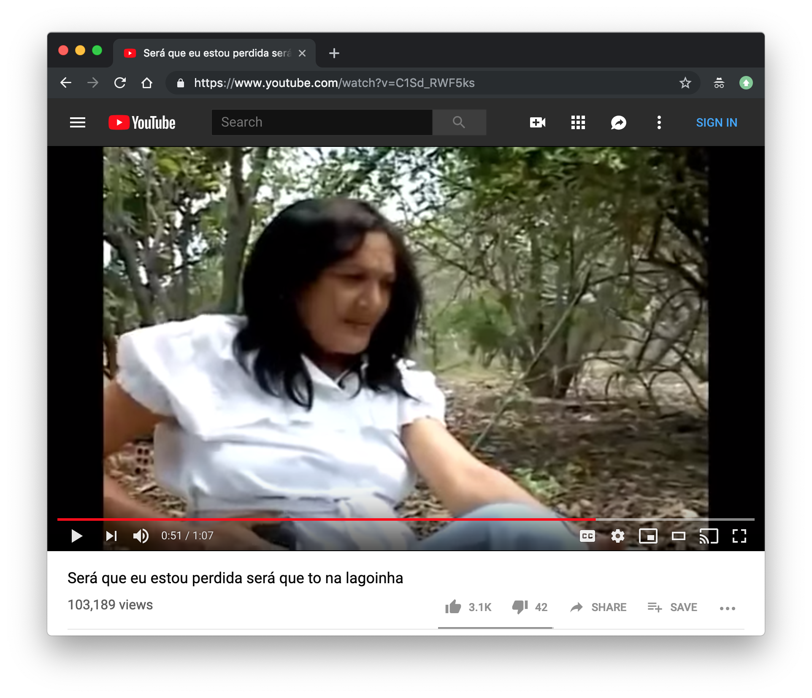

<p align="center">
  <h2 align="center">
    Lagoinha
  </h2>
  <p align="center">
    Utilitário Golang para busca por CEP integrado diretamente aos serviços dos Correios, ViaCEP e outros <br />
    <a href="https://www.youtube.com/watch?v=C1Sd_RWF5ks" align="center">
      
    </a>
  </p>
</p>

--- 

Lagoinha é basicamente um pacote que usa a API dos Correios, ViaCep e outros para pegar o endereço com base em um CEP. O que o pacote faz, é disparar pra todas as APIs ao mesmo tempo e retornar com o resultado da primeira API que responder.

### Por que esse nome

É simples, veja o vídeo acima!
(onde é que eu tô, lagoinha, CEP, endereço...)

### Instalação

```sh
go get -u https://github.com/IgorHalfeld/lagoinha.git
```

### Como usar

```golang
package main

import (
	"fmt"

	"github.com/igorhalfeld/lagoinha/cep"
)

func main() {
	address, _ := cep.Cep("CEP_GOES_HERE")
	fmt.Printf("Complete Address %v:", address)
}
```

### Licença

[1 Coríntios 6:12](https://www.bibliaonline.com.br/nvi/1co/6/12)
